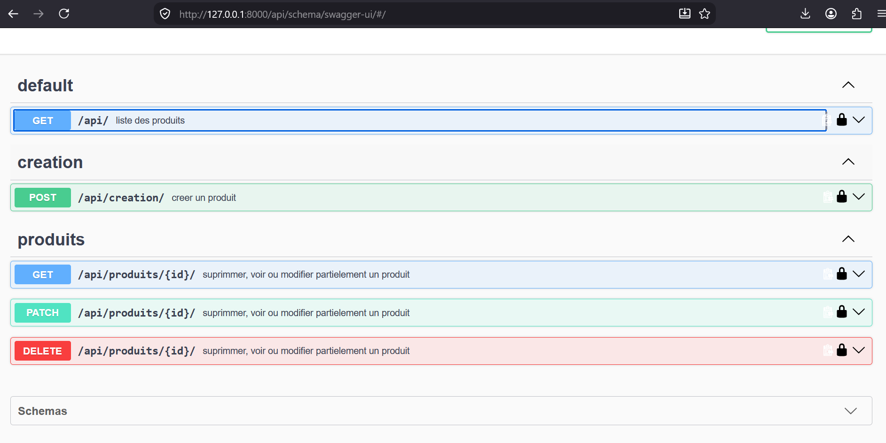
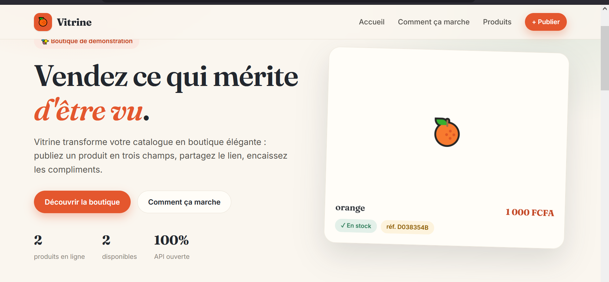

# Django REST Framework API - Backend

Projet backend Django REST Framework pour la gestion des produits, avec sérialisation, API REST et documentation Swagger générée automatiquement.

## Aperçu

Cette application expose une API pour gérer des produits associés à un propriétaire. Elle comprend :

- un modèle `Owner` lié à l’utilisateur Django,
- un modèle `Produits` avec informations du produit,
- des endpoints REST pour lister, créer, consulter, modifier et supprimer des produits,
- une documentation Swagger / Redoc via `drf-spectacular`.

## Screenshot Swagger


# Interface

## Stack technique backend

- Python
- Django
- Django REST Framework (DRF)
- drf-spectacular
- SQLite
- Pillow
- rembg
- Git

## Structure du projet

```text
backend/
├── config/
│   ├── __init__.py
│   ├── settings.py
│   ├── urls.py
│   ├── wsgi.py
│   └── asgi.py
├── essai/
│   ├── migrations/
│   ├── admin.py
│   ├── apps.py
│   ├── models.py
│   ├── serializers.py
│   ├── tests.py
│   ├── urls.py
│   └── views.py
├── media/
├── static/
│   └── images/
├── db.sqlite3
├── manage.py
└── .venv/

frontend/
├── src/
│   ├── api/client.js       (client HTTP vers l'API Django)
│   ├── components/         (Navbar, Footer, UI partagée)
│   ├── pages/              (Accueil, Produits, ProduitNouveau, ProduitDetail)
│   ├── App.jsx
│   ├── main.jsx
│   └── index.css           (design system)
├── index.html
├── vite.config.js
└── package.json
```

## Modèles

### Owner

- `nom` : relation OneToOne avec l’utilisateur Django
- `photo_profil` : image de profil facultative

### Produits

- `id` : UUID généré automatiquement
- `owner` : relation ForeignKey vers l’utilisateur
- `nom_produit`
- `prix`
- `image_produit`
- `disponibilite`
- `description`

## Endpoints API

### Produits

- `GET /api/produits/` : liste des produits
- `POST /api/produits_creer/` : création d’un produit
- `GET /api/produits/<uuid:id>/` : détail d’un produit
- `PATCH /api/produits/<uuid:id>/` : modification partielle d’un produit
- `DELETE /api/produits/<uuid:id>/` : suppression d’un produit
- `GET /api/utilisateurs/` : liste des utilisateurs (id + username)

### Documentation

- `GET /api/schema/` : schéma OpenAPI
- `GET /api/schema/swagger-ui/` : interface Swagger UI
- `GET /api/schema/redoc/` : documentation Redoc

## Frontend (React + Vite)

Interface « Vitrine » branchée sur l'API : landing page, catalogue avec recherche,
fiche produit détaillée, création/édition (avec upload d'image) et suppression.

```bash
cd frontend
npm install
npm run dev
```

L'application est servie sur http://localhost:5173. En développement, Vite
proxifie automatiquement `/api`, `/media` et `/admin` vers Django (port 8000) —
aucune configuration CORS à gérer côté navigateur.

Pages :

- `/` — landing page (hero animé, étapes, aperçu catalogue, bandeau API)
- `/produits` — catalogue complet avec recherche instantanée
- `/produits/nouveau` — publier un produit (formulaire multipart avec image)
- `/produits/:id` — fiche produit : détail, édition inline, suppression

Pour pointer vers un backend autre que `http://127.0.0.1:8000`, définissez la
variable d'environnement `VITE_API_URL` (ex. dans `frontend/.env.local`).

## Fonctionnalités

- gestion des produits via API REST,
- sérialisation automatique avec DRF,
- validation des données côté API,
- génération automatique de documentation OpenAPI,
- rendu d’images et gestion d’images produits/profils,
- tests Django intégrés pour modèles, sérializers et endpoints.

## Prérequis

- Python 3.x
- pip
- virtualenv ou venv

## Installation

1. Cloner le projet :

```bash
git clone <url-du-repo>
cd django_rest_framework
```

2. Créer et activer un environnement virtuel :

```bash
python -m venv .venv
.venv\Scripts\activate
```

3. Installer les dépendances :

```bash
pip install django djangorestframework drf-spectacular pillow rembg
```

4. Lancer les migrations :

```bash
cd backend
python manage.py migrate
```

5. Démarrer le serveur :

```bash
python manage.py runserver
```

## Vérification rapide

Pour exécuter les tests :

```bash
python manage.py test
```

Pour accéder à la documentation Swagger :

```text
http://127.0.0.1:8000/api/schema/swagger-ui/
```

## Notes

- Les images de produits et de profils sont stockées dans le dossier `backend/media/` (servies en développement par `config/urls.py`).
- La base de données utilisée actuellement est SQLite (`backend/db.sqlite3`).

## Auteur

Projet développé par ATTOBRA PRINCE dans le cadre d’un apprentissage Django / DRF avec API documentée et testée.
